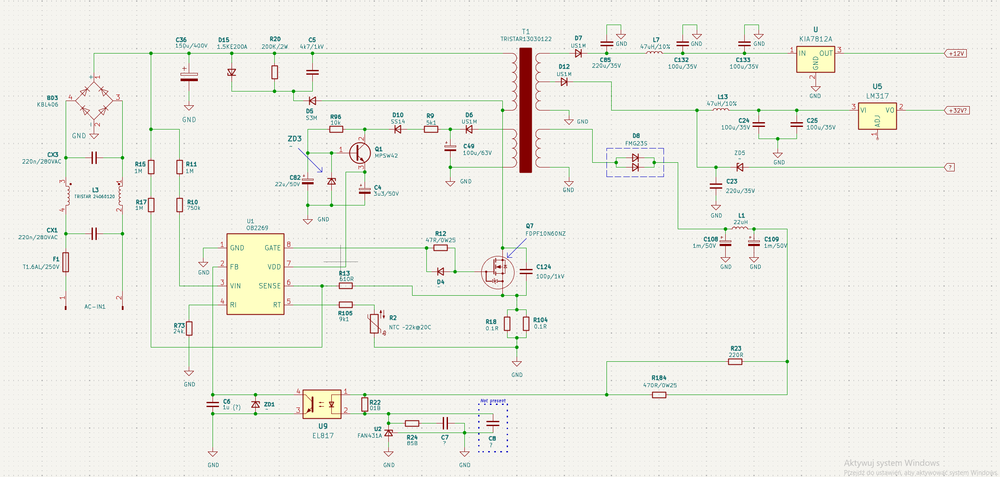

# Marshall Stanmore I - Power Supply Schematic

This repository contains a reverse-engineered schematic of the **power supply stage** for the **Marshall Stanmore I** speaker. 

Since Marshall does not release official service manuals or schematics for their products, repairing this board can be very difficult. This project aims to document the hardware to make repairs, troubleshooting, and modifications easier for the DIY and repair community.

## ⚠️ Safety Warnings

**READ BEFORE ATTEMPTING ANY REPAIRS!**
Working on Switch-Mode Power Supplies (SMPS) is dangerous. 
* ⚡ **Lethal Voltages:** The "HOT" side of this PCB operates at mains voltage (110V/230V AC) and rectifies it to **over 320V DC**. 
* 🔋 **Capacitor Discharge:** The main filter capacitor (**C36**, the large black capacitor near the high-frequency transformer) can hold a lethal 320V charge for a long time *even after the speaker is unplugged*. **Always discharge C36 using a bleeder resistor** (e.g., 2kΩ / 5W) and verify with a multimeter before touching the board.
* **Isolation:** Use an isolation transformer if you plan to probe the hot side with an oscilloscope.

## 📖 Origin & Credits

The foundational work for this schematic was done by **Josef Aichhorn** ([@juptec](https://www.mikrocontroller.net/user/show/juptec)), who shared his original hand-drawn schematics on a [mikrocontroller.net forum thread](https://www.mikrocontroller.net/topic/547728). Huge thanks and respect to Josef for this schematic. This board is covered in glue and is rather complex, making reverse-engineering incredibly tedious.

**My Contributions:**
* Redrew the entire schematic in a KiCad 9 for better readability.
* Verified (most of the) connections against my board.
* Added some of the missing component values (resistors, capacitors, diodes).
* Added direct links to datasheets for most of the main components.

> **Disclaimer:** While care was taken to verify this schematic, both the original author and I could have simply *made mistakes*. Component values might also vary slightly between different hardware revisions. Use this schematic as a guide, not an absolute truth.

---

## 🔍 Common Failure Points:

* **Fuse (F1)**
  * Often blows :).
* **The Current Mode PWM Switch (U1): [OB2269N](https://uploadcdn.oneyac.com/attachments/files/brand_pdf/hgsemi/D3/B0/OB2269N.pdf)**
  * PWM Switch. Drives the primary switching MOSFET, often burnt.
* **The main MOSFET (Q7): [FDPF10N60NZ](https://www.onsemi.com/pdf/datasheet/fdpf10n60nz-d.pdf)**
  * N-Channel, 600 V, 10 A, MOSFET, often burnt.
* **The Opto Coupler (U9): [EL817](https://w.electrodragon.com/w/images/2/27/EL817.pdf)**
  * Standard optocoupler, used to isolate feedback to the OB2269N.
* **Capacitor C34**
  * The 3u3, 50V electrolytic capacitor located next to the PWM Switch, often shorted or high ESR.
* **Capacitor C36**
  * The main 150u, 400V electrolytic capacitor, sometimes shorted or high ESR.
* **100W Audio Amp (U15) [TSA5342A](https://w.electrodragon.com/w/images/2/27/EL817.pdf)**
  * The main (and only) audio amp, legs sometimes burnt, along with the tracks.
* **Any components surrounding the OB2269N**
  * This area of the board seems to be causing most of the problems present in the device.

---

## 📄 The Schematic

*(Click the image to view the full resolution)*

  

### Download:
* [High-Resolution Image (PNG)](png/schematic.png)

## 🤝 Contributing
Feel free to fork this repository and add more parts of the schematic.
